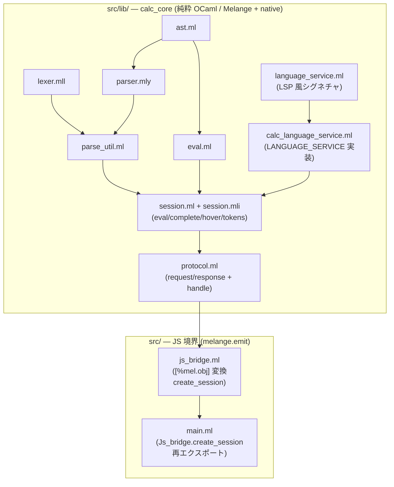
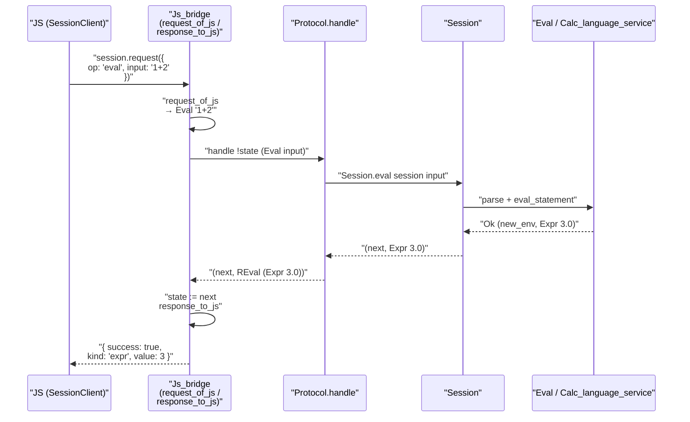
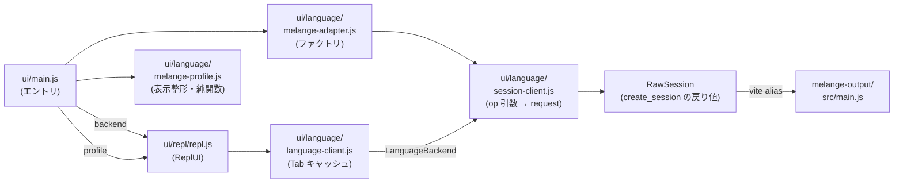
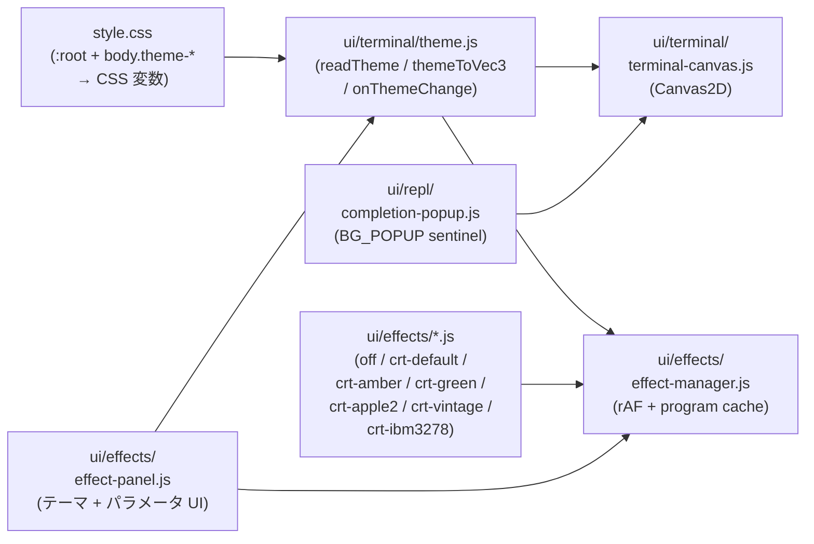

# ARCH: Melange ↔ JS 接続の仕組み

このドキュメントは `learn-melange` リポジトリで OCaml (Melange) と JavaScript
(Vite + ブラウザ) がどのように連結されているかをまとめたものである。

## 全体像

```mermaid
flowchart LR
    subgraph OCaml["OCaml ソース"]
      A1["src/lib/*.ml<br/>(calc_core)"]
      A2["src/js_bridge.ml<br/>(JS 境界)"]
      A3["src/main.ml<br/>(エントリ)"]
    end

    subgraph Build["dune + melange.emit"]
      B1["(modes melange byte native)"]
      B2["[%mel.obj] PPX"]
    end

    subgraph Output["_build/default/src/output/"]
      C1["src/main.js<br/>src/js_bridge.js"]
      C2["src/lib/*.js"]
      C3["node_modules/<br/>melange, melange.js,<br/>melange.__private__..."]
    end

    subgraph Vite["Vite (ui/ をルート)"]
      D1["resolve.alias で<br/>melange-output/ 解決"]
      D2["HMR"]
    end

    Browser["ブラウザ"]

    OCaml --> Build
    Build --> Output
    Output -->|"alias 経由で<br/>import"| Vite
    Vite --> Browser
```



2 段パイプライン:

1. **OCaml → JS**: `dune build` が `melange.emit` スタンザを実行し、OCaml ソースを
   ES6 モジュールとして `_build/default/src/output/` に書き出す。
2. **JS → ブラウザ**: Vite が `ui/` を root として起動し、`resolve.alias` で
   `_build/default/src/output/` 配下を仮想 npm パッケージのように見せかけ、
   ブラウザに配信する。

OCaml を書き換えると `.ml → .js → HMR` の順で即座に反映される。

JS 側はさらに **言語抽象層** (`LanguageBackend` / `LanguageProfile`) と **テーマ層**
(`ui/terminal/theme.js` の CSS 変数レイヤ) を挟んでおり、Melange への依存は
`ui/language/melange-adapter.js` と `ui/language/melange-profile.js` に閉じ込め
られている。`ui/main.js` の import を差し替えれば REPL 本体 (ReplUI) を変えずに
別言語のバックエンドに切り替えられる構造になっている (詳細は §4)。

## 1. OCaml 側のレイヤ分離

`src/` 配下は **3 つの責務層** に分かれている。



### 1.1 `src/lib/` — 純粋 OCaml ライブラリ (`calc_core`)

`src/lib/dune`:

```dune
(library
 (name calc_core)
 (modes melange byte native)
 (libraries menhirLib)
 (preprocess (pps melange.ppx)))

(rule
 (targets parser.ml parser.mli)
 (deps parser.mly)
 (action (run %{bin:menhir} --table %{deps})))

(ocamllex lexer)
```

- **`(modes melange byte native)`** — Melange 出力に加えて、ネイティブ OCaml でも
  ビルドされる。これによりテストを `dune runtest` で実行できる。
- `(preprocess (pps melange.ppx))` により Melange PPX が効く (今は calc_core 内で
  `[%mel.obj]` は使われていないが、将来の拡張と他モジュールとの一貫性のため有効に
  しておく)。
- Menhir (incremental API) と ocamllex で構築したパーサ/レキサを計算エンジンに
  使っている。

| ファイル | 役割 |
|---|---|
| `ast.ml` | 式・文の AST 定義 |
| `lexer.mll` | ocamllex によるトークナイザ |
| `parser.mly` | menhir incremental parser |
| `parse_util.ml` | `feed_tokens` / `drain` の共通ドライバ |
| `eval.ml` | AST 評価と環境管理 (`env = float StringMap.t`) |
| `language_service.ml` | LSP 風シグネチャ (`LANGUAGE_SERVICE`) の宣言 |
| `calc_language_service.ml` | 電卓向けの言語サービス実装 (complete/hover/tokens) |
| `session.ml` / `session.mli` | REPL セッション (env + 言語サービス委譲) |
| `protocol.ml` | `request` / `response` variant + `handle` ディスパッチ |

ここには **`[%mel.obj]` や `Js.Nullable` は一切登場しない**。純粋 OCaml なので
ネイティブでもテストできる。

### 1.2 `src/js_bridge.ml` — JS 境界の唯一の場所

`calc_core` の `Protocol.handle` を JS 側から呼べるようにするためのブリッジ。

```ocaml
let create_session () =
  let state = ref Calc_core.Session.empty in
  [%mel.obj {
    request = (fun (req : request_js) ->
      let r = request_of_js req in
      let (next, resp) = Protocol.handle !state r in
      state := next;
      response_to_js resp);
  }]
```

- **`[%mel.obj { request = ... }]`** で「`request` メソッドを 1 つ持つ JS
  オブジェクト」を返す。
- `request_of_js` で `{ op, input, offset }` を `Protocol.request` 代数的データ型に
  変換。
- `response_to_js` で `Protocol.response` を JS 値 (shape は kind ごとに異なる) に
  変換。`Obj.magic` で型を統一する unsafe cast は**この 1 箇所に閉じ込めている**。
- セッション状態 `state` は `ref` にクロージャでキャプチャされ、複数回 `request`
  を呼んでも持続する。

### 1.3 `src/main.ml` — エントリポイント

```ocaml
let create_session = Js_bridge.create_session
```

JS 側から `import { create_session } from 'melange-output/src/main.js'` で参照される
入り口。`main.ml` がそのまま `main.js` に変換される。中身は `Js_bridge` への
再エクスポートのみ。

### 1.4 `src/dune` — JS 出力スタンザ

```dune
(melange.emit
 (target output)
 (alias melange)
 (module_systems es6)
 (libraries calc_core)
 (preprocess (pps melange.ppx)))
```

- `melange.emit` は「ここから JS を吐く」宣言。`src/` 直下の `.ml` (= `main.ml`,
  `js_bridge.ml`) と `calc_core` ライブラリが JS に変換される。
- `(target output)` によって出力先が `_build/default/src/output/` になる。
- `(module_systems es6)` で ES6 モジュール形式を指定 (Vite/ブラウザが直接読める)。
- `(alias melange)` により `dune build @melange` でも起動できる (現在はルート
  `dune build` でも同時にビルドされる)。

## 2. 単一 request エンドポイント

JS 側からは `session.request({ op, input, offset })` **1 本だけ** を呼ぶ。`op` は
`'eval' | 'complete' | 'diagnose' | 'hover' | 'tokens'` の discriminated union。



この構造の利点:

- **Worker 化が楽** — `session.request(req)` を `worker.postMessage(req)` に
  置き換えれば、ブリッジ層はそのままに UI スレッドから外せる。
- **LSP サーバ化が楽** — `Protocol.request` / `Protocol.response` はそのまま
  JSON-RPC にマッピングできる。
- **新しい操作の追加が 1 箇所ずつ** — `Protocol.request` に variant を追加し、
  `Protocol.handle` に分岐を足し、JS 側のクライアントに 1 メソッド追加するだけ。

## 3. Melange の相互運用プリミティブ

`src/js_bridge.ml` が JS 境界で使っている Melange の機能:

### 3.1 `[%mel.obj { ... }]` — OCaml レコード → JS オブジェクト

```ocaml
let make_expr_result (v : float) : result_obj =
  [%mel.obj {
    success = true;
    kind = "expr";
    name = Js.Nullable.null;
    value = Js.Nullable.return v;
    error_message = Js.Nullable.null;
    error_column = Js.Nullable.null;
  }]
```

PPX が展開時に **JS オブジェクトリテラル** へ変換する。JS 側では通常のオブジェクト
としてプロパティアクセスできる。

### 3.2 open object type (`< ... > Js.t`)

```ocaml
type result_obj = <
  success : bool;
  kind : string;
  name : string Js.Nullable.t;
  value : float Js.Nullable.t;
  error_message : string Js.Nullable.t;
  error_column : int Js.Nullable.t;
> Js.t
```

OCaml のオブジェクト型で JS 側の「形」を表現する。型定義が JS オブジェクトの構造を
そのまま反映する。同じ shape は JS 側の `ui/types.d.ts` にも `EvalResultObj` として
定義されており、**OCaml と TypeScript の二重契約**になっている (手動同期)。

### 3.3 `Js.Nullable.t` — OCaml option の代わり

OCaml の `option` 型は JS では少し扱いづらいため、`Js.Nullable.t` を使い
`Js.Nullable.null` / `Js.Nullable.return v` で `null | value` を表現する。JS 側では
`result.value === null` で単純に判定できる。

### 3.4 クロージャ + `ref` で状態保持

```ocaml
let create_session () =
  let state = ref Calc_core.Session.empty in
  [%mel.obj {
    request = (fun (req : request_js) ->
      let r = request_of_js req in
      let (next, resp) = Protocol.handle !state r in
      state := next;
      response_to_js resp);
  }]
```

`Session.t` は immutable なレコードで、`Session.eval` は新しいレコードを返す純関数。
JS 側は「1 つのセッションオブジェクトを使い回す」UX を期待するため、`ref` で包んで
`request` メソッド内部で state を差し替える。これが **OCaml 純粋層 ↔ JS 可変 API**
の橋渡しになっている。

### 3.5 OCaml variant → JS 値の統一: `Obj.magic`

`Protocol.response` は 5 種類の variant で、それぞれ JS 側の shape が異なる
(eval は object、complete は array、hover は object-or-null、...)。OCaml の型
システム上は 1 つの型にまとめられないので、`js_bridge.ml` の `response_to_js` が
各ブランチで `Obj.magic` を使って `< > Js.t` に揃える。

```ocaml
let response_to_js (resp : P.response) : < > Js.t =
  match resp with
  | P.REval r -> Obj.magic (eval_result_to_js r)
  | P.RComplete items ->
    Obj.magic (Array.of_list (List.map completion_to_js items))
  ...
```

runtime では no-op (Melange の型は消去される) で、**unsafe cast はこの関数内だけに
閉じ込められている**。JS 側は `SessionClient` (次節) が各 `op` の戻り値型を知って
いるので、境界を越えたあとは静的型チェックが効く。

## 4. JS 側のレイヤ



### 4.1 抽象レイヤ: `LanguageBackend` / `LanguageProfile`

`ui/language/backend.d.ts` が 2 つの interface を宣言している (`.d.ts` は型置き場
としてのみ使い、実体は JS)。ReplUI はこの 2 つの契約にしか依存しない:

- **`LanguageBackend`** — `eval(input)` / `complete(input, offset)` / optional
  `diagnose` / `hover` / `tokens`。データ取得系の契約。
- **`LanguageProfile`** — `prompt` / `banner` / `formatResult` / `formatError` /
  `completionStyleFor(kind)`。UI 表示側の契約 (純関数のみ)。

実装は OCaml/Melange 向けの 1 組:

- `ui/language/melange-adapter.js` が `createMelangeBackend()` を提供。内部で
  `create_session()` を呼んで `SessionClient` を包むだけ。
- `ui/language/melange-profile.js` は `LanguageProfile` の純実装。OCaml ビルド
  成果物に依存しないので、`ui/__tests__/melange-profile.test.js` が単体で走る。

言語を差し替える際は新しいアダプタ (例 `lua-adapter.js`) と profile を書き、
`ui/main.js` の import を差し替えるだけで REPL 本体は変更不要。

### 4.2 `SessionClient` / `LanguageClient` / `ReplUI`

- **`SessionClient`**: `.eval(input)` / `.complete(input, offset)` / `.diagnose` /
  `.hover` / `.tokens` の 5 メソッドを持ち、内部では `#call(op, payload)` で
  `session.request({ op, ...payload })` を呼ぶ。型的には
  `LanguageBackend` を満たす。
- **`LanguageClient`**: `LanguageBackend` を受け取り、Tab 連打時の直近 1 件
  キャッシュだけを持つ薄い層 (complete のみラップ)。
- **`ReplUI`**: コンストラクタで `{ mount, backend, profile }` を受け取り、
  キー入力・画面描画・effect 切替を組み立てる。副作用は `#withRender` ラッパ
  で `requestRender` とペアになり、呼び忘れが構造的に防がれる。

### 4.3 型付け: checkJs + `.d.ts`

プロジェクトは `.js` で書き、`tsc --noEmit` + `checkJs` で型検査だけを受ける
方針 (tsconfig.json の `allowJs` + `checkJs`)。型情報の置き場は 2 本の
`.d.ts`:

- **`ui/types.d.ts`** — OCaml↔JS の境界型 (`SessionOp` / `EvalResultObj` /
  `CompletionItem` / `Cell` / `Segment` / `ActionName` 等)。`src/js_bridge.ml`
  の open object type と **手動で同期** する二重契約。Vite の `*.frag?raw` /
  `*.glsl?raw` の module 宣言もここに置く。
- **`ui/language/backend.d.ts`** — REPL↔言語サービスの抽象 (`LanguageBackend`
  / `LanguageProfile`)。

`.js` 側では `@typedef {import('../types.d.ts').Cell} Cell` 形式で型を借り、
`@param` / `@returns` で注釈する (`repl.js` / `cell-buffer.js` /
`session-client.js` 他、14 ファイルで使用)。

段階的導入のため、未対応ファイルは冒頭に `// @ts-nocheck` を置いて opt-out
している (現状: `ui/effects/*`, `ui/gfx/*`, `ui/terminal/terminal-canvas.js`,
`ui/terminal/theme.js`, `ui/language/melange-*.js` など)。

## 5. ビルド成果物の構造

`dune build` 後の `_build/default/src/output/` レイアウト:

```
_build/default/src/output/
├── src/
│   ├── main.js                 ← create_session をエクスポート (ui からの入口)
│   ├── js_bridge.js            ← request_of_js / response_to_js / create_session 本体
│   └── lib/
│       ├── session.js
│       ├── protocol.js
│       ├── calc_language_service.js
│       ├── language_service.js
│       ├── eval.js
│       ├── parse_util.js
│       ├── parser.js
│       ├── lexer.js
│       └── ast.js
└── node_modules/
    ├── melange/                               ← OCaml 標準ライブラリの JS 移植
    ├── melange.js/                            ← Js.Nullable などの相互運用
    └── melange.__private__.melange_mini_stdlib/
```

重要な点:

- Melange は **自前の node_modules ディレクトリ構造** を output 配下に生成する。
  ランタイムと標準ライブラリはここに入る。
- 生成された `.js` ファイル同士は相対パスと `node_modules/` ルックアップで
  解決し合う通常の ES モジュールとして動く。
- つまり output ディレクトリは丸ごと「自己完結した小さな npm ワールド」になっている。

## 6. Vite 側の橋渡し (`vite.config.js`)

```js
import { defineConfig } from 'vite';
import path from 'path';

const melangeOutput = path.resolve(__dirname, '_build/default/src/output');
const melangeNodeModules = path.join(melangeOutput, 'node_modules');

export default defineConfig({
  root: 'ui',
  resolve: {
    alias: {
      'melange-output': melangeOutput,
      'melange.js':     path.join(melangeNodeModules, 'melange.js'),
      'melange.__private__.melange_mini_stdlib':
                        path.join(melangeNodeModules, 'melange.__private__.melange_mini_stdlib'),
      'melange':        path.join(melangeNodeModules, 'melange'),
    }
  },
  server: { fs: { allow: ['..'] } },
  build:   { target: 'esnext' },
  optimizeDeps: { esbuildOptions: { target: 'esnext' } },
});
```

ポイント:

- `root: 'ui'` で Vite のルートはフロントエンドディレクトリ。
- `resolve.alias` により、`_build/default/src/output/` をあたかも `melange-output`
  という npm パッケージかのように見せる。同時に `melange` / `melange.js` /
  `melange.__private__.melange_mini_stdlib` という Melange ランタイムの「仮想
  パッケージ」も登録する (出力 JS 内の `import 'melange/stdlib.js'` 等を解決する
  ため)。
- `server.fs.allow: ['..']` で Vite が root 外 (`_build/`) へ読みに行くのを許可
  する。
- `esnext` ターゲットで最新 JS 機能をそのまま通す (Melange の出力は ES6+ 機能を
  前提)。

型チェック (`tsc --noEmit`) には `melange-output/*` は解決できないので、別途
`ui/melange-output-stub/src/main.js.d.ts` にスタブ型を置いて `tsconfig.json` の
`paths` 設定で解決している。ランタイムは vite alias、型チェックは paths alias、
の二重構成。

## 7. JS 側からの呼び出し (`ui/repl/repl.js`)

```js
import { create_session } from 'melange-output/src/main.js';
import { SessionClient } from '../language/session-client.js';
import { LanguageClient } from '../language/language-client.js';

this.session = new SessionClient(create_session());
this.languageClient = new LanguageClient(this.session);

// 評価
const result = this.session.eval(trimmed);
if (result.success) {
  if (result.kind === 'expr') {
    // result.value: float
  } else {
    // result.kind === 'binding' → result.name / result.value
  }
} else {
  // result.error_message / result.error_column
}
```

エイリアスを経由して `_build/default/src/output/src/main.js` に解決され、そこから
再帰的に `./js_bridge.js` → `./lib/protocol.js` → `./lib/session.js` → ... と
辿ってランタイムまで展開される。Vite の依存最適化 (`optimizeDeps`) が ES モジュール
群をまとめてブラウザに配信する。

境界での型マッピング:

| OCaml 側 | JS 側 |
|---|---|
| `< f : T > Js.t` object type | 通常の JS オブジェクト |
| `[%mel.obj { f = v }]` | `{ f: v }` リテラル |
| `string` / `float` / `int` / `bool` | 同名のプリミティブ |
| `Js.Nullable.t` | `T \| null` |
| 関数 (クロージャ) | JS 関数 (環境はクロージャで保持) |
| `Protocol.request` variant | `{ op: SessionOp, input?, offset? }` |
| `Protocol.response` variant | `op` ごとに異なる shape (Obj.magic で統一) |

## 7.5 UI 副次レイヤ: テーマ / エフェクト



- **テーマの単一ソース** は `style.css` の CSS カスタムプロパティ
  (`--term-bg` / `--term-fg` / `--term-color-*` / `--term-popup-*` /
  `--panel-*`)。`body.theme-amber` / `body.theme-green-phosphor` の class 切替で
  プロファイル全体が入れ替わる (既定は `melange`、body 無 class)。
- **`ui/terminal/theme.js`** が CSS 変数を読み取り、Canvas2D 用の CSS 文字列 /
  WebGL 用の `vec3` (`themeToVec3`) の両方に正規化する。JSDOM 対策で空値時は
  組み込み FALLBACK を返す。
- **`Cell.style.bg`** の値が `BG_POPUP` / `BG_POPUP_SELECTED` のような
  名前付きキーなら TerminalCanvas 側で theme 経由に解決する。
  `ui/terminal/cell-style-keys.js` に定数を集約。
- **EffectManager** は `defaultParams` に `null` を入れた「テーマ sentinel」
  (現状は `fontColor` / `bgColor`) を、`onThemeChange` 経由で現在テーマの
  `foreground` / `background` から自動解決する。`crt-default` がこの仕組みで
  テーマ連動する。`crt-amber` / `crt-green` 等はプロファイル固有色を固定
  `vec3` として持つため sentinel の影響を受けない。
- **`EffectPanel`** は `EffectManager.paramMeta` を読んで UI を自動生成する
  設定パネル (CSS 変数駆動)。`Ctrl+Shift+P` でトグル。

## 7.6 エフェクトプロファイル (CRT プリセット)

`ui/effects/index.js` で登録され、`ui/effects/crt-passes.js` が共通 passes
関数 / defaults / paramMeta を export する。各プリセット (`crt-default` /
`crt-amber` / `crt-green` / `crt-apple2` / `crt-vintage` / `crt-ibm3278`) は
`defaultParams` が違うだけで同一シェーダー/同一パイプラインを共有するため、
`RenderGraph` の program cache が効いて切替コストはほぼゼロ。

現在のパイプライン (`crt-passes.js`):

```
source → threshold → blurH → blurV → burnin (feedback: burninPrev) → composite → screen
                                                                        ↑
                                                                       prev (前フレーム)
```

`burnin.frag` が `feedbackAs: 'burninPrev'` で自分自身の前フレームをサンプル
しながら減衰させ、`composite` 側で `uBurninMix` として合成する。`composite`
の `rasterMode` uniform で `None / Scanlines / Pixel Grid / RGB Subpixel` を
切り替える。

## 8. 開発ワークフロー

典型的な並行実行:

```sh
# 端末 1: OCaml ウォッチビルド
dune build --watch

# 端末 2: Vite 開発サーバ
npm run dev
```

- `.ml` を保存 → dune が `_build/.../output/` を更新 → Vite が差分検知 →
  ブラウザ HMR。
- `npm run build` で `vite build` が走り、`ui/dist/` に静的サイトが出力される
  (Melange 出力は build 済みの `_build` を参照するので、dune build を先に通して
  おく必要がある)。
- `npm run test:all` で `dune runtest` (Alcotest 36 tests) → `tsc --noEmit` →
  `vitest run` (76 tests: cell-buffer / history / line-editor / readline-keys /
  width / melange-profile) を順に実行する。

## 9. まとめ

- **Melange が OCaml を ES6 モジュールとして `_build` に吐き、Vite が alias で
  それを通常の npm パッケージのように見せかけてブラウザへ配信する**、というのが
  このリポジトリの全体構成。
- 純粋 OCaml 層 (`calc_core`) と JS 境界層 (`src/js_bridge.ml`) を分離することで、
  `calc_core` はネイティブでテストでき、境界コードは `[%mel.obj]` / `Js.Nullable`
  の影響を受ける部分に閉じ込められている。
- JS 境界は `session.request({ op, ... })` の**単一エンドポイント**。`Protocol` の
  代数的データ型を経由するため、将来 Worker 化や LSP 化する際にブリッジ実装を
  差し替えるだけで済む。
- 相互運用の要は `[%mel.obj]`, `Js.Nullable.t`, open object type (`< ... > Js.t`),
  そして `Obj.magic` を使った response 値の型統一 (`js_bridge.response_to_js` に
  局所化)。
- ランタイム (OCaml stdlib 相当) は Melange が生成する output 配下の `node_modules/`
  に自己完結しており、Vite の alias がこれを横取りしてブラウザ向けにバンドルする。
- JS 側は **`LanguageBackend` / `LanguageProfile` 抽象** と **CSS 変数駆動の
  テーマ層** の 2 つの可換軸を持ち、REPL 本体 (`ReplUI`) は言語・テーマ・
  エフェクトプロファイルのいずれからも独立している。Melange 依存は
  `melange-adapter.js` + `melange-profile.js` に、CRT シェーダーは共通
  `crt-passes.js` に集約されている。
- `.js` + `tsc --noEmit` (checkJs) + `.d.ts` (types/backend) の軽量型付け方式を
  採用。型情報は `ui/types.d.ts` と `ui/language/backend.d.ts` に集約され、
  JSDoc `import()` 経由で `.js` から参照する。
